# ReCode 项目可视化说明

> 用图表和动画的方式理解 ReCode 是如何工作的

---

## 一、ReCode 到底在做什么？🤔

### 1.1 一句话解释

**ReCode 就像一个会编程的 AI 助手，它能把复杂的任务自动拆解成小步骤，然后一步步执行。**

### 1.2 生活中的类比 🏠

想象你要做一道菜 "西红柿炒鸡蛋"：

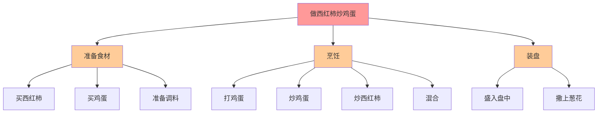

**ReCode 做的就是这个拆解过程！** 它把"做菜"这个复杂任务，自动拆成"准备"、"烹饪"、"装盘"，再拆成更小的步骤。

---

## 二、核心概念可视化 📊

### 2.1 传统方法 vs ReCode

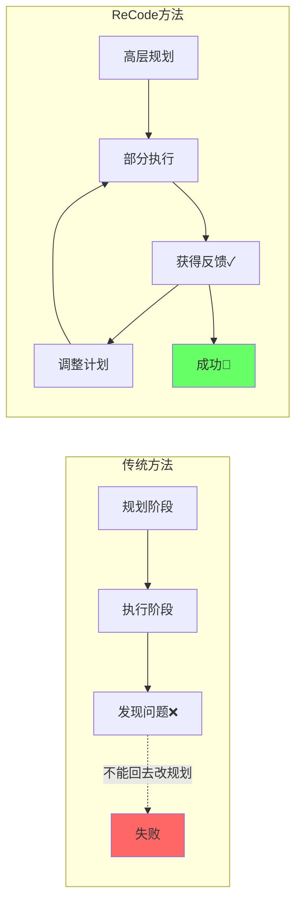

**关键差异**：
- ❌ 传统方法：先想好所有步骤，再一次性执行
- ✅ ReCode：边想边做，随时调整

### 2.2 代码树结构

ReCode 用一棵树来组织任务：

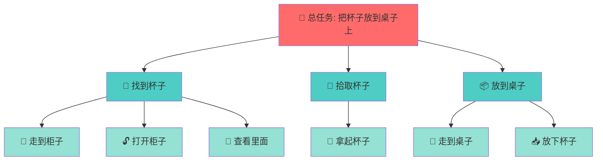

**树的层次**：
- 🔴 **根节点**：最顶层的总任务
- 🔵 **中间节点**：子任务（还需要继续拆解）
- 🟢 **叶子节点**：具体的动作（可以直接执行）

---

##三、完整工作流程 🔄

### 3.1 整体流程图

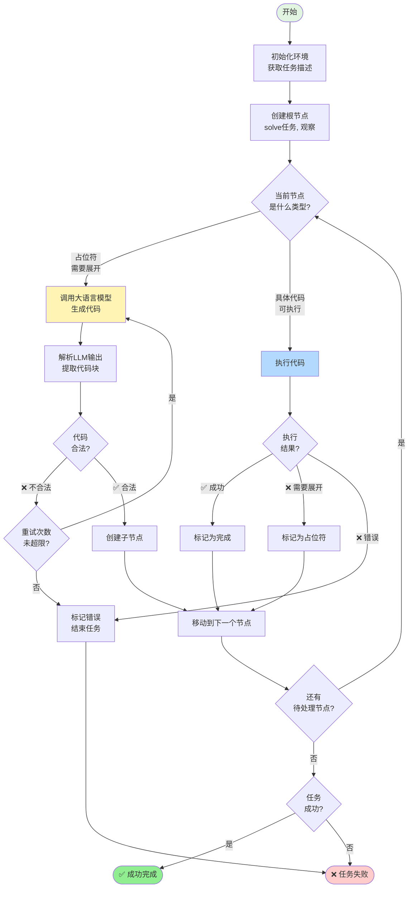

### 3.2 状态转换图

节点在执行过程中会经历不同的状态：

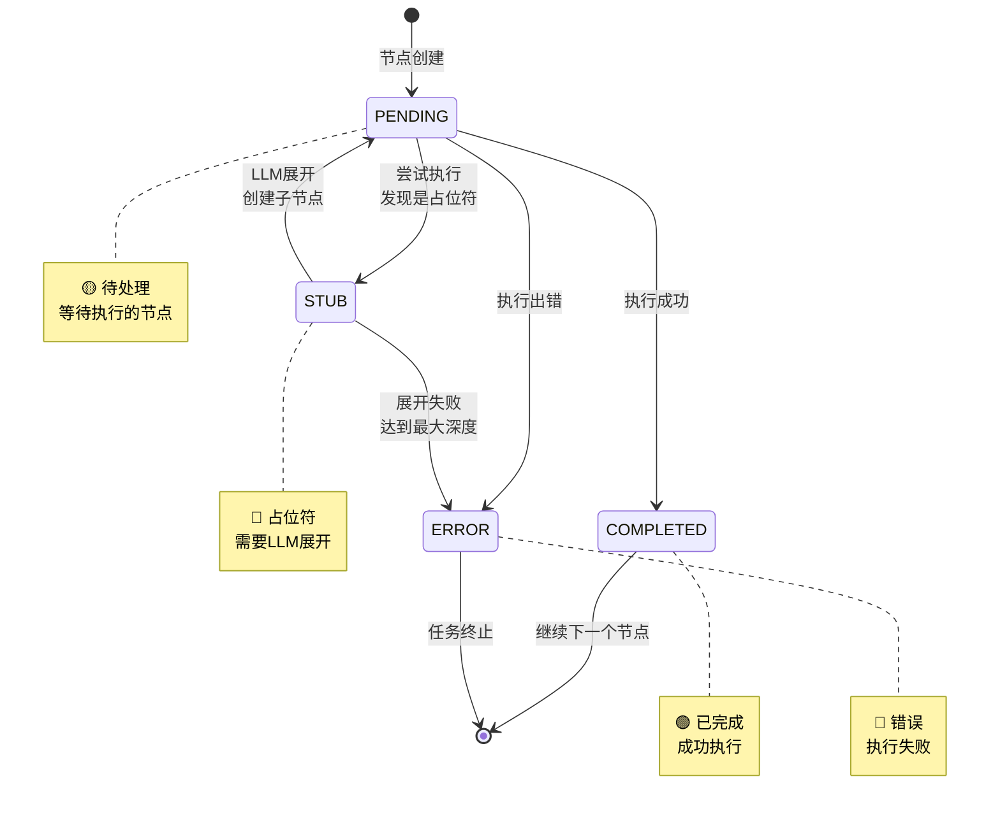

---

## 四、执行过程动画演示 🎬

### 4.1 任务：将杯子放到桌子上

#### 步骤 1️⃣：初始化

```
📋 收到任务: "把杯子放到桌子上"
🌍 环境观察: "你在房间中央，可以看到柜子、桌子、架子"

创建代码树：
┌─────────────────────────────┐
│ solve(instruction, obs)     │  ⬅️ 根节点（占位符）
│ 状态: PENDING               │
└─────────────────────────────┘
```

#### 步骤 2️⃣：第一次展开

```
🤖 调用 LLM：请展开 solve(instruction, obs)

💭 LLM 思考:
   "这个任务需要三步：找杯子、拿杯子、放杯子"

📝 LLM 输出代码：
   target = find_mug(observation)
   pick_up(target)
   place_on_desk(target)

代码树变化：
┌─────────────────────────────┐
│ solve(instruction, obs)     │  ✅ 已展开
│ 状态: COMPLETED             │
└──────────┬──────────────────┘
           │
    ┌──────┴──────┬──────────────┐
    │             │              │
┌───▼────┐  ┌────▼────┐  ┌─────▼─────┐
│find_mug│  │pick_up  │  │place_on   │  ⬅️ 三个子节点
│PENDING │  │PENDING  │  │ _desk     │
│        │  │         │  │PENDING    │
└────────┘  └─────────┘  └───────────┘
```

#### 步骤 3️⃣：展开 find_mug

```
🤖 调用 LLM：请展开 find_mug(observation)

💭 LLM 思考:
   "需要在不同位置查找，先去柜子看看"

📝 LLM 输出代码：
   obs1 = run("go to cabinet 1")
   obs2 = run("open cabinet 1")
   obs3 = run("look")

代码树变化：
┌─────────────────────────────┐
│ solve(instruction, obs)     │  ✅
└──────────┬──────────────────┘
           │
    ┌──────┴──────┬──────────────┐
    │             │              │
┌───▼────┐  ┌────▼────┐  ┌─────▼─────┐
│find_mug│  │pick_up  │  │place_on   │
│COMPLETE│  │PENDING  │  │ _desk     │
└───┬────┘  └─────────┘  │PENDING    │
    │                    └───────────┘
    │
┌───┴────────────────────┐
│                        │
▼                        ▼
run("go to cabinet 1")   run("open cabinet 1")
PENDING                  PENDING
                         ▼
                    run("look")
                    PENDING
```

#### 步骤 4️⃣：执行具体动作

```
▶️ 执行: run("go to cabinet 1")

🌍 环境返回:
   "你来到柜子前，看到柜子1上有一个杯子1和盘子1"

💾 保存结果: obs1 = "你来到柜子前..."

代码树变化：
┌─────────────────────────────┐
│ solve(instruction, obs)     │  ✅
└──────────┬──────────────────┘
           │
    ┌──────┴──────┬──────────────┐
    │             │              │
┌───▼────┐  ┌────▼────┐  ┌─────▼─────┐
│find_mug│  │pick_up  │  │place_on   │
│COMPLETE│  │PENDING  │  │ _desk     │
└───┬────┘  └─────────┘  │PENDING    │
    │                    └───────────┘
    │
┌───┴────────────────────┐
│                        │
▼                        ▼
run("go to cabinet 1")   run("open cabinet 1")
✅ COMPLETED             PENDING
obs1 = "你来到..."
                         ▼
                    run("look")
                    PENDING
```

#### 步骤 5️⃣：继续执行...

```
▶️ 执行: run("open cabinet 1")
🌍 返回: "你打开了柜子1"
💾 obs2 = "你打开了柜子1"

▶️ 执行: run("look")
🌍 返回: "柜子1里有杯子1和盘子1"
💾 obs3 = "柜子1里有..."

🎯 继续执行 pick_up, place_on_desk...

最终：
✅ 所有节点都执行完成
🎉 任务成功！
```

---

## 五、核心组件可视化 🧩

### 5.1 系统架构图

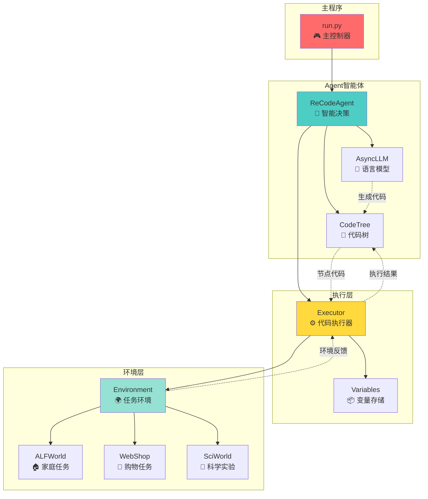

### 5.2 ReCodeAgent 内部结构

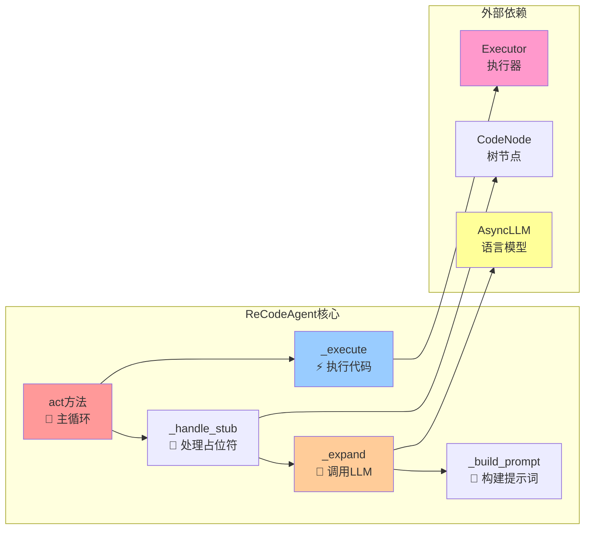

### 5.3 Executor 工作原理

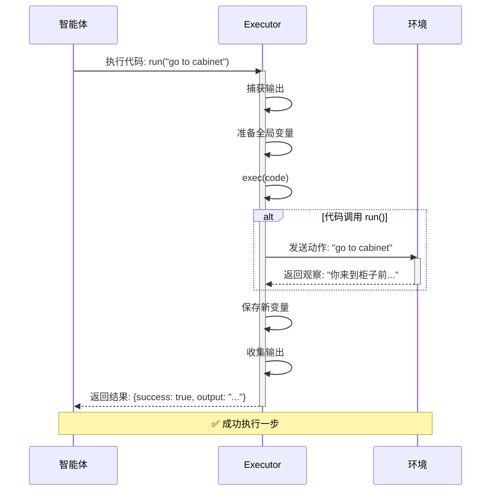

---

## 六、数据流向图 💾

### 6.1 完整的数据流

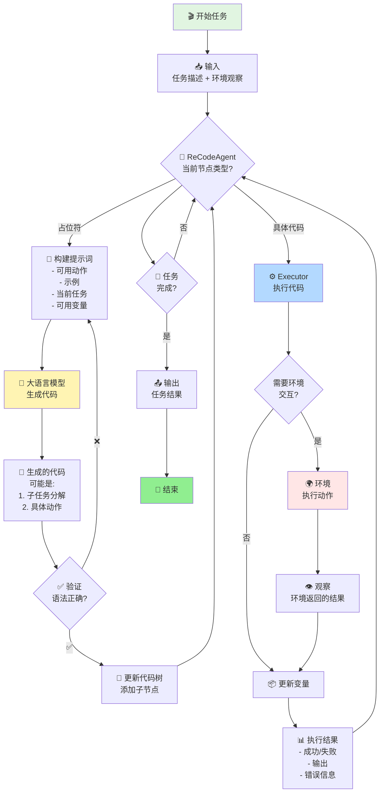

### 6.2 变量的生命周期

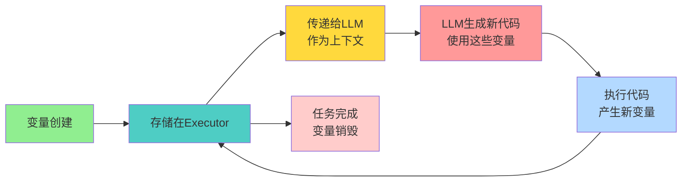

---

## 七、实际案例演示 📱

### 7.1 案例：在线购物（WebShop）

**任务**：买一个红色的杯子，价格低于30美元

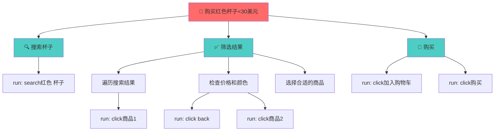

**执行流程**：

```
第1步 🔍 搜索
├─ 执行: search["红色 杯子"]
└─ 结果: 显示10个商品

第2步 📋 筛选
├─ 查看商品1
│  ├─ 颜色: 红色 ✅
│  ├─ 价格: $45 ❌ (太贵)
│  └─ 跳过
├─ 查看商品2
│  ├─ 颜色: 蓝色 ❌
│  └─ 跳过
└─ 查看商品3
   ├─ 颜色: 红色 ✅
   ├─ 价格: $25 ✅
   └─ 选中！

第3步 🛒 购买
├─ 执行: 加入购物车
├─ 执行: 结账
└─ 完成 🎉
```

### 7.2 案例：家庭任务（ALFWorld）

**任务**：把冰箱里的生菜清洗后放到台面上

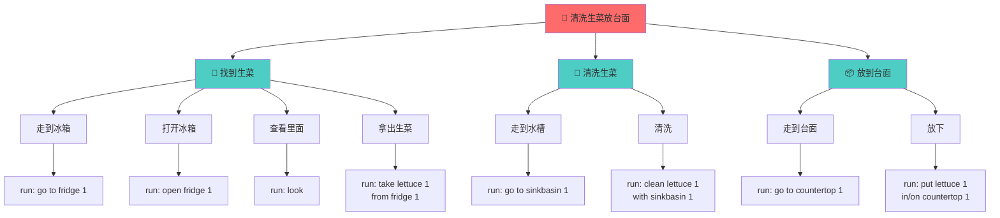

---

## 八、关键技术点 🔑

### 8.1 提示词工程

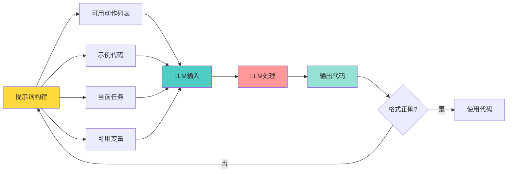

### 8.2 错误处理机制

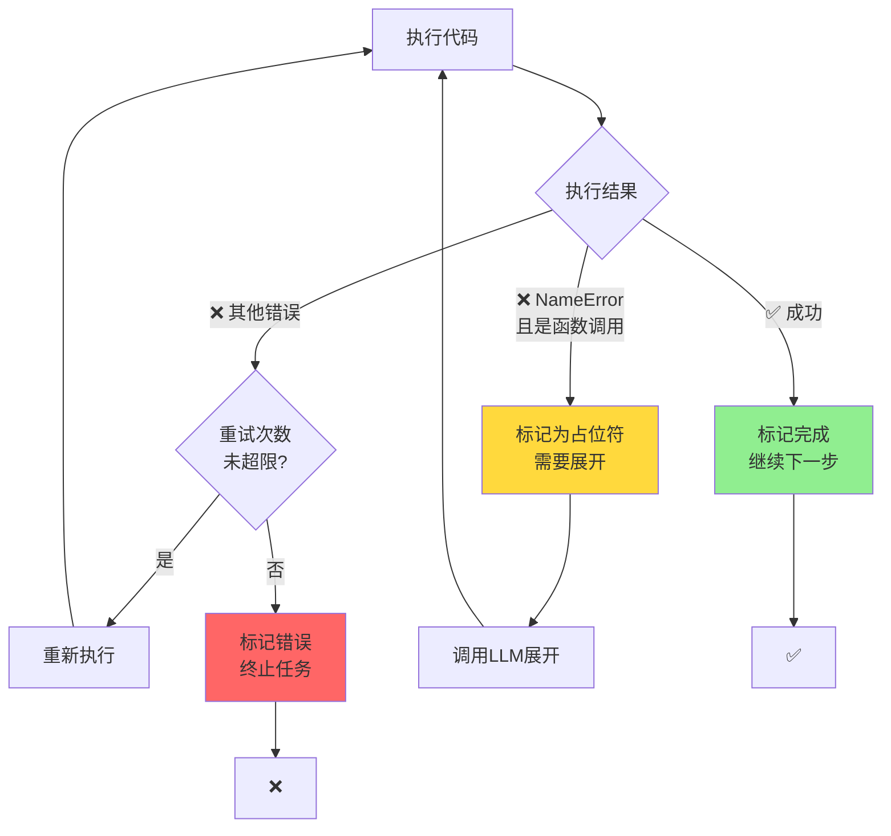

---

## 九、性能特点 📈

### 9.1 优势对比

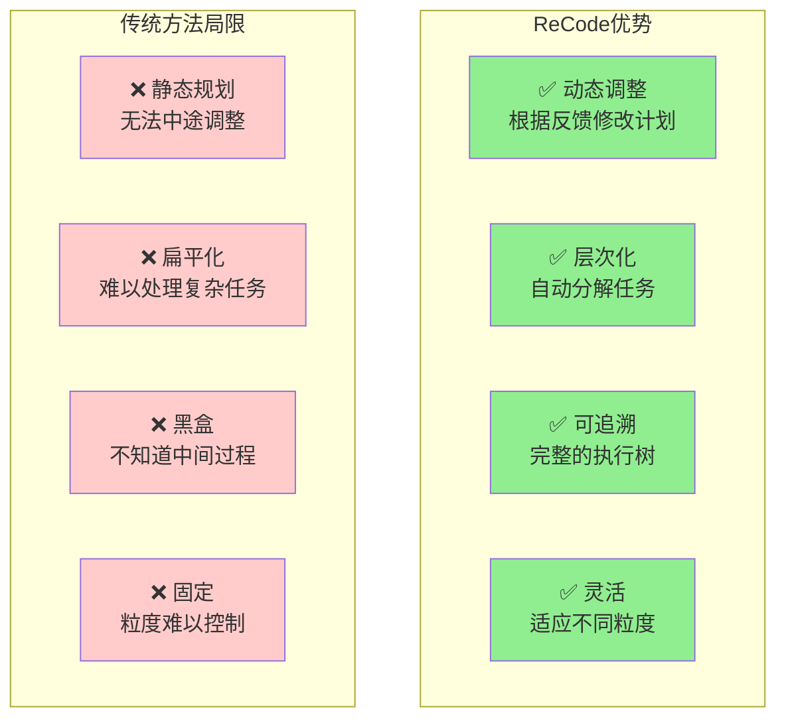

### 9.2 实验结果

```
环境性能对比
━━━━━━━━━━━━━━━━━━━━━━━━━━━━━━━━━━━━

ALFWorld (家庭任务)
ReCode:  ████████████████████ 100%
ReAct:   ███████████████░░░░░ 75%
CodeAct: ██████████████░░░░░░ 70%

WebShop (在线购物)
ReCode:  ████████████████░░░░ 80%
ReAct:   ████████████░░░░░░░░ 60%
CodeAct: ███████████░░░░░░░░░ 55%

SciWorld (科学实验)
ReCode:  ████████░░░░░░░░░░░░ 40%
ReAct:   ██████░░░░░░░░░░░░░░ 30%
CodeAct: ████░░░░░░░░░░░░░░░░ 20%

平均性能
ReCode:  ████████████████░░░░ 73.3%
最佳基线: ████████████░░░░░░░░ 60%
提升:    ▲ 22.2% 🎉
```

---

## 十、快速开始 🚀

### 10.1 安装流程

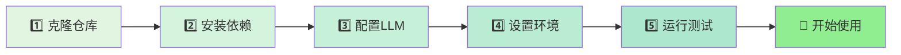

### 10.2 运行命令

```bash
# 🏠 测试 ALFWorld 环境
python run.py -a recode -e alfworld -n 1 --profile default

# 🛒 测试 WebShop 环境
python run.py -a recode -e webshop -n 1 --profile default

# 🔬 测试 SciWorld 环境
python run.py -a recode -e sciworld -n 1 --profile default

# 📊 批量测试（10个实例，并发3个）
python run.py -a recode -e alfworld -n 10 -c 3 --profile gpt-4o
```

---

## 十一、总结 🎓

### 核心理念

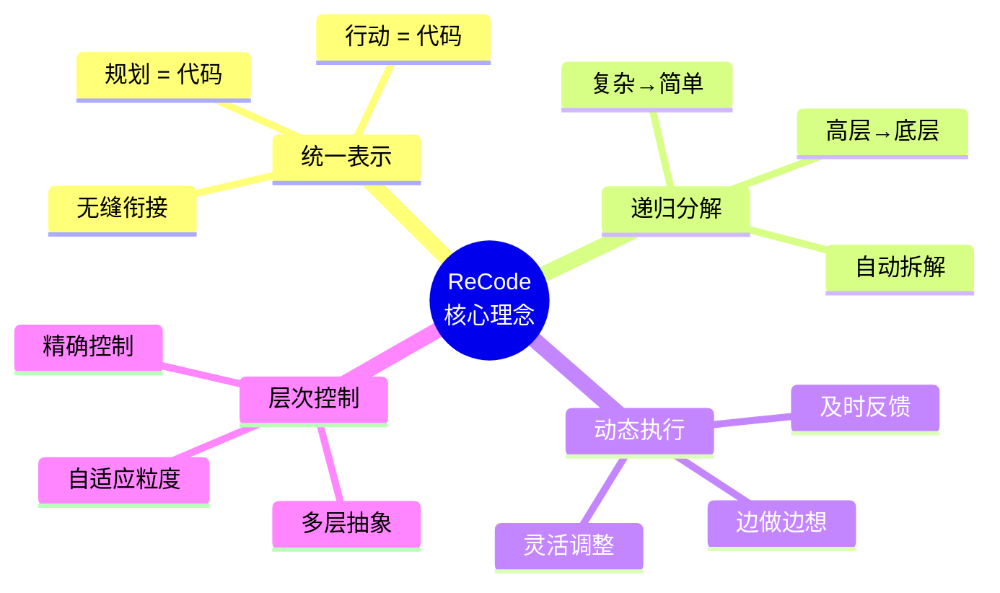

### 工作流程总结

```
ReCode 工作流程 5 步法
━━━━━━━━━━━━━━━━━━━━━━━━━━━━━━━━

1️⃣ 接收任务
   └─ 从环境获取任务描述

2️⃣ 创建代码树
   └─ 根节点 = solve(任务, 观察)

3️⃣ 递归展开
   ├─ 遇到占位符 → 调用 LLM
   └─ 生成子任务或具体代码

4️⃣ 执行代码
   ├─ 具体动作 → 与环境交互
   └─ 保存结果和变量

5️⃣ 循环直到完成
   └─ 遍历所有节点直到任务完成

━━━━━━━━━━━━━━━━━━━━━━━━━━━━━━━━
```

### 为什么 ReCode 强大？

1. **🧠 智能规划**：像人一样思考，把大任务拆成小步骤
2. **🔄 动态调整**：根据反馈随时修改计划
3. **📊 可追溯**：每一步都有记录，方便调试
4. **🎯 精确控制**：自动适应任务复杂度
5. **🚀 性能优越**：在多个环境中超越传统方法

---

## 附录：术语表 📖

| 术语 | 中文 | 解释 |
|------|------|------|
| Agent | 智能体 | 执行任务的 AI 系统 |
| Environment | 环境 | 任务执行的场景 |
| LLM | 大语言模型 | 如 GPT-4, Claude 等 |
| Placeholder | 占位符 | 需要进一步展开的函数 |
| Code Tree | 代码树 | 组织任务的树形结构 |
| Executor | 执行器 | 运行代码的组件 |
| Observation | 观察 | 环境返回的反馈信息 |
| Action | 动作 | 与环境交互的操作 |
| Expansion | 展开 | 将占位符转换为具体代码 |
| Node | 节点 | 代码树中的一个元素 |

---

**🎉 恭喜你！现在你已经完全理解 ReCode 是如何工作的了！**

如果你想深入了解技术细节，请查看 `DOCUMENTATION_CN.md` 文档。
